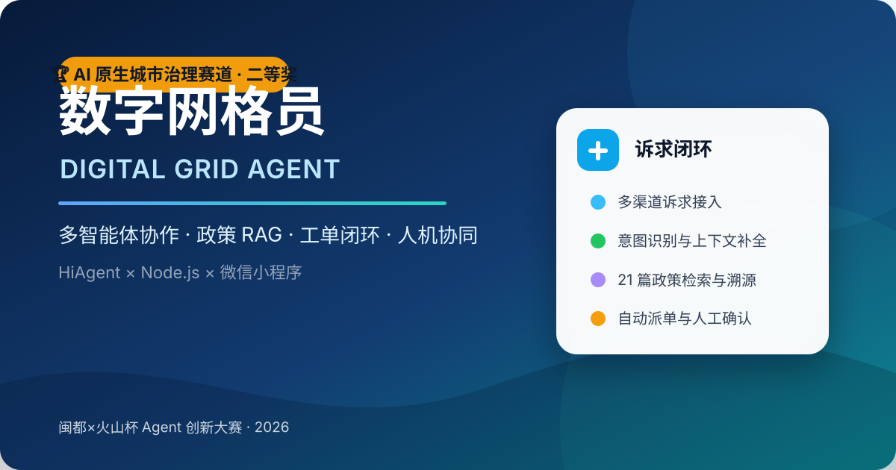
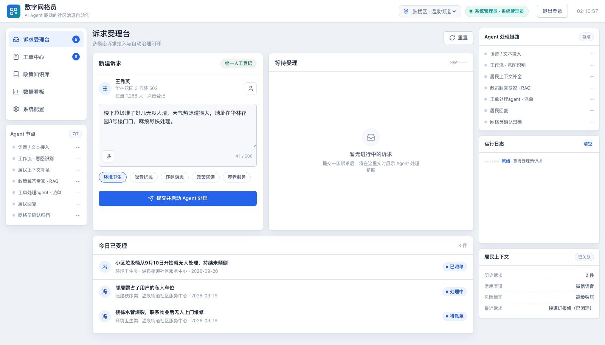
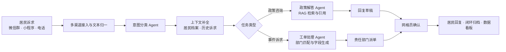
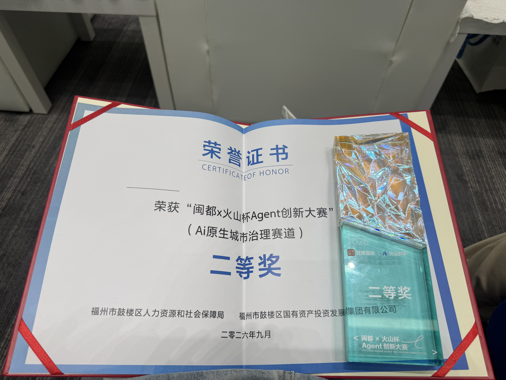

<p align="center">
  
</p>

<h1 align="center">数字网格员 · Digital Grid Agent</h1>

<p align="center">
  基于火山引擎 HiAgent、多智能体协作与 RAG 的社区治理诉求闭环系统
</p>

<p align="center">
  
  
  
  
  
</p>

<p align="center">
  <a href="https://forwindreach.github.io/digital-grid-agent/">在线体验</a> ·
  <a href="#快速开始">本地运行</a> ·
  <a href="docs/方案说明书.md">技术方案</a> ·
  <a href="docs/演示脚本.md">演示脚本</a>
</p>

> 🏆 本项目获 **“闽都×火山杯 Agent 创新大赛”AI 原生城市治理赛道二等奖**。比赛演示视频将更新为正式版本。

## 项目概览

数字网格员面向社区网格治理中“渠道分散、政策难查、派单依赖经验、办理过程难追踪”的问题，将居民诉求接入、意图识别、政策检索、工单生成、部门派发、居民回复和人工归档连接为一条可追溯链路。

系统包含网格员 Web 工作台、居民微信小程序、Node.js 轻量后端、HiAgent 多 Agent 工作流，以及由 21 篇福州与鼓楼区公开政策构建的可溯源知识库。默认模拟模式无需密钥即可体验；配置 HiAgent 后可切换到真实推理链路。

| 可验证内容 | 当前实现 |
| --- | --- |
| 政策知识库 | 21 篇公开政策文件，保留标题、文号与来源信息 |
| 诉求入口 | 微信群、小程序、电话转写三类场景 |
| 意图类别 | 政策咨询、环境卫生、噪音扰民、违建秩序、其他诉求 |
| 使用端 | 网格员 Web 工作台 + 居民微信小程序 |
| 运行模式 | 本地模拟 / HiAgent 真实接口 |

## 系统预览



核心操作路径：接收诉求 → 识别意图 → 补全居民上下文 → 检索政策 → 生成工单 → 人工确认 → 回复与归档。

## 系统架构



### Agent 分工

| Agent / 模块 | 主要职责 | 关键输出 |
| --- | --- | --- |
| 意图分类助手 | 识别诉求类型、抽取要素、评估紧急度 | 分类、地点、事件、置信度 |
| 上下文补全 | 关联居民档案、历史诉求与风险标签 | 结构化上下文 |
| 政策解答专家 | 检索政策知识库并生成带来源的回答 | 政策依据、答复建议 |
| 工单处理 Agent | 匹配责任部门、生成标准工单 | 工单字段、派单建议、SLA |
| 人工确认层 | 处理低置信度或高风险结果 | 确认、退回、转人工、归档 |

## 核心能力

- **多渠道诉求接入**：统一承接群聊、小程序和电话转写场景。
- **居民档案与上下文**：支持姓名、手机号、楼栋房号检索，新登记、地址变更和 Excel 批量导入。
- **政策 RAG**：围绕网格管理、12345、市容环卫、物业、消防、养老等主题检索，并保留政策来源。
- **自动派单与工单生成**：把自然语言诉求转换为责任部门可处理的结构化工单。
- **人机协同闭环**：Agent 提供判断和草稿，最终归档由网格员确认。
- **双端协同**：网格员通过 Web 工作台处理，居民通过微信小程序登记、沟通并查询工单。
- **模拟 / 真实双模式**：无密钥即可演示完整流程，也可接入发布后的 HiAgent API。

## 技术实现

| 层级 | 技术与设计 |
| --- | --- |
| Web 前端 | HTML、CSS、原生 JavaScript，组件化视图与本地演示流水线 |
| 居民端 | 微信小程序原生框架 |
| 后端 | Node.js 内置模块，静态托管、身份校验、工单与会话 API、HiAgent 代理 |
| Agent 平台 | 火山引擎 HiAgent，多 Agent 工作流与子智能体编排 |
| 知识检索 | 政策文档切分、导入、召回与引用溯源 |
| 数据层 | 演示版 JSON 本地存储；生产环境需替换为受控数据库 |

## 快速开始

### 环境要求

- Node.js 18 或更高版本
- 现代浏览器
- 可选：微信开发者工具、已发布的 HiAgent 应用

### 启动 Web 工作台

```bash
git clone https://github.com/Forwindreach/digital-grid-agent.git
cd digital-grid-agent
npm start
```

浏览器访问：<http://127.0.0.1:3100>

默认使用本地模拟模式，不需要 API Key。健康检查地址：<http://127.0.0.1:3100/api/health>。

### 接入真实 HiAgent

在 Web 工作台的“系统配置”中填写已发布应用的接口地址、应用 ID、工作流 ID 与 API Key，或参照 [`docs/合体指南.md`](docs/合体指南.md) 使用本地运行时配置。密钥只保存在被 Git 忽略的 `data/runtime/` 中。

### 微信小程序

使用微信开发者工具导入仓库根目录，项目配置已指向 `miniprogram/`。公开版使用访客 AppID，本地联调时替换为自己的 AppID。详见 [`docs/小程序接入说明.md`](docs/小程序接入说明.md)。

## 项目结构

```text
.
├── index.html / app.js / styles.css   # 网格员 Web 工作台
├── server.js / lib/                   # Node.js 后端与 HiAgent 网关
├── miniprogram/                       # 居民微信小程序
├── data/                              # 演示数据、知识库映射与导入内容
├── knowledge-base/official/           # 21 篇公开政策原文
├── resources/hiagent-exports/         # HiAgent 应用与子智能体导出包
├── docs/                              # 技术方案、接入说明与演示脚本
├── scripts/                           # macOS、Linux、Windows 启动脚本
├── tests/                             # 无依赖冒烟测试
└── assets/                            # 项目视觉、截图与获奖材料
```

## 个人职责与团队协作

**Forwindreach**：主要负责项目的前端与后端设计、开发和联调；与团队成员共同参与 Agent 的方案设计、工作流编排、开发与调试。

- 主要负责网格员 Web 工作台、居民档案、工单中心、知识库和数据看板等前端功能。
- 主要负责 Node.js 后端、会话与工单 API、身份校验和 HiAgent 代理层。
- 参与居民微信小程序与 Web、后端之间的联调和演示流程完善。
- 与团队成员共同完成意图分类、政策问答、工单处理等 Agent 的职责划分、编排与调试。

**坳皋OvO**:主要负责Agent的方案设计，工作流编排，开发与调试。共同参与前端后端设计开发。

团队名称：**玄黄二人组**。

## 获奖与认可

本项目于 2026 年 9 月获得 **“闽都×火山杯 Agent 创新大赛”（AI 原生城市治理赛道）二等奖**。

<p align="center">
  
</p>

## 文档导航

- [技术方案](docs/方案说明书.md)
- [HiAgent 配置指南](docs/HiAgent配置指南.md)
- [小程序接入说明](docs/小程序接入说明.md)
- [居民批量导入说明](docs/居民批量导入说明.md)
- [系统使用说明](docs/数字网格员系统使用说明书.md)
- [现场演示脚本](docs/演示脚本.md)
- [安全与隐私说明](docs/安全与隐私.md)

## 工程边界

本仓库是比赛演示与学习版本，不等同于可直接承载真实政务数据的生产系统：

- 页面中的姓名、手机号、地址、工单与统计指标均为演示数据。
- 真实部署还需要数据库、权限分级、审计、加密、脱敏、监控和容灾能力。
- 政策文件可能更新，真实答复前必须核对政府网站现行版本。
- Agent 输出用于辅助研判，高风险事项和最终归档保留人工确认。

---

如果这个项目对你有启发，欢迎通过 Issue 交流社区治理 Agent、RAG 和人机协同设计。
